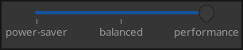

# Power Profile Control Gui

This little gui tool uses `powerprofilectl` to set power profile for your computer.



## Requirements

Get `power-profiles-daemon` package on your distro. 

## Build

```bash
cargo b --release
```

## Sway / Waybar integration

You can add `ppctl-gui` to your battery config in your waybar as on-click:

```json
"battery": {
    "on-click": "ppctl-gui",
    ...
}
```

and make sway open the app in the corner on floating

Example for 1080p display:
```toml
for_window [app_id="ppctl_gui"] {
    floating enable;
    move right 792; # (1920 - 330)/2 - 3
    move down 500; # (1080 - 50)/2 - 15
}

```